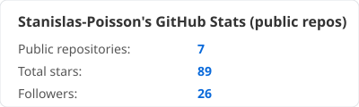
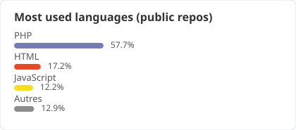

# Hi, I'm Stanislas 👋

![Experience][badge-experience]

Senior Fullstack Engineer specialized in Laravel, Vue.js and Docker. I take fragile, legacy web platforms and rebuild them into something a team can actually maintain.

🟢 **Open to opportunities**: full-time roles (Île-de-France / remote) or freelance missions (remote, starting October 2026).

## What I focus on

- Legacy system refactoring and migration to modern architecture
- Technical debt reduction with measurable results
- Industrialized environments: Docker, CI/CD, code quality tooling
- Technical mentoring: standards, code review, onboarding

## Tech stack

![Laravel][badge-laravel] ![Vue.js][badge-vue] ![Docker][badge-docker] ![PHP][badge-php] ![JavaScript][badge-js] ![GitLab CI][badge-gitlab-ci] ![MySQL][badge-mysql] ![Redis][badge-redis]

## GitHub stats

  
  

## GitLab stats

  
  

## A few things I've built

- **[French-zip-code][repo-fzc]**: Laravel package maintaining a normalized database of France's zip codes, built from official INSEE data. 87 stars, still actively used and referenced on data.gouv.fr.
- **[teams-auto-presence][repo-tap]**: Chrome extension that automates Microsoft Teams presence status. Published on the Chrome Web Store.
- **[devtools-resize-fix][repo-drf]**: Chrome extension fixing a Chromium layout bug. Also published on the Chrome Web Store.
- **Zairakai Ecosystem**: personal SaaS & tooling ecosystem (Docker images, Laravel/TypeScript packages) on [gitlab.com/zairakai][gitlab].

## Find me

[![Website][pill-website]][website] [![LinkedIn][pill-linkedin]][linkedin] [![GitLab][pill-gitlab]][gitlab] [![Email][pill-email]][email]

<!-- Links -->
[repo-fzc]: https://github.com/Stanislas-Poisson/French-zip-code
[repo-tap]: https://github.com/Stanislas-Poisson/teams-auto-presence
[repo-drf]: https://github.com/Stanislas-Poisson/devtools-resize-fix
[gitlab]: https://gitlab.com/zairakai
[website]: https://stanislas-poisson.fr
[linkedin]: https://www.linkedin.com/in/stanislasp/
[email]: mailto:contact@stanislas-poisson.fr

<!-- Badges - Stack -->
[badge-experience]: https://img.shields.io/badge/Experience-10%2B_years-blue
[badge-laravel]: https://img.shields.io/badge/Laravel-FF2D20?style=flat&logo=laravel&logoColor=white
[badge-vue]: https://img.shields.io/badge/Vue.js-4FC08D?style=flat&logo=vuedotjs&logoColor=white
[badge-docker]: https://img.shields.io/badge/Docker-2496ED?style=flat&logo=docker&logoColor=white
[badge-php]: https://img.shields.io/badge/PHP-777BB4?style=flat&logo=php&logoColor=white
[badge-js]: https://img.shields.io/badge/JavaScript-F7DF1E?style=flat&logo=javascript&logoColor=black
[badge-gitlab-ci]: https://img.shields.io/badge/GitLab_CI-FC6D26?style=flat&logo=gitlab&logoColor=white
[badge-mysql]: https://img.shields.io/badge/MySQL-4479A1?style=flat&logo=mysql&logoColor=white
[badge-redis]: https://img.shields.io/badge/Redis-DC382D?style=flat&logo=redis&logoColor=white

<!-- Badges - Pills (mêmes couleurs que les pills de l'extension devtools-resize-fix) -->
[pill-website]: https://img.shields.io/badge/stanislas--poisson.fr-2563EB?style=flat&logo=googlechrome&logoColor=white
[pill-linkedin]: https://img.shields.io/badge/LinkedIn-0A66C2?style=flat&logo=linkedin&logoColor=white
[pill-gitlab]: https://img.shields.io/badge/GitLab-FC6D26?style=flat&logo=gitlab&logoColor=white
[pill-email]: https://img.shields.io/badge/Email-555555?style=flat&logo=gmail&logoColor=white
